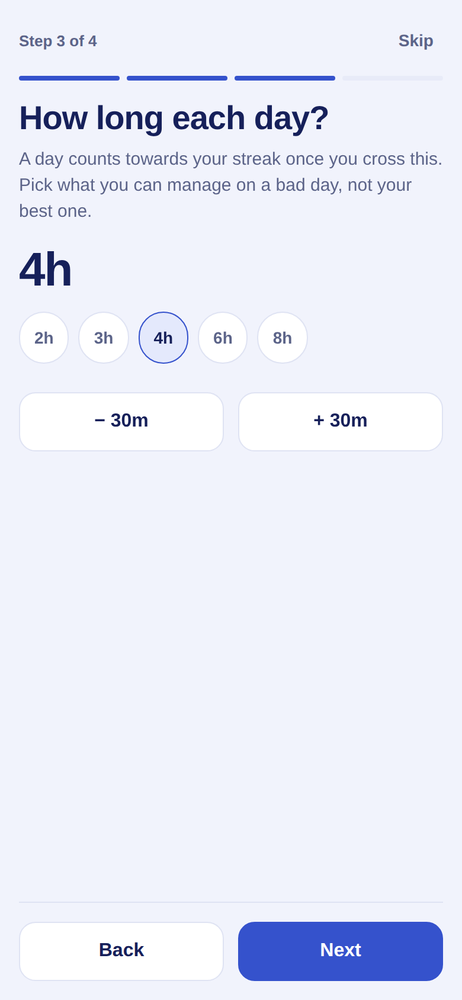
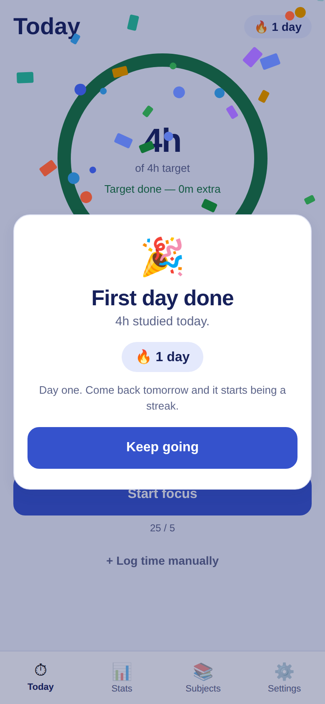
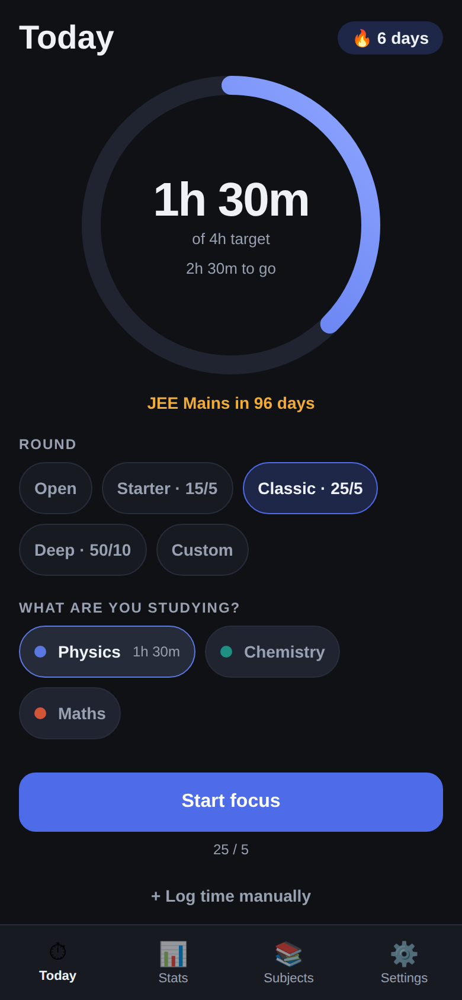
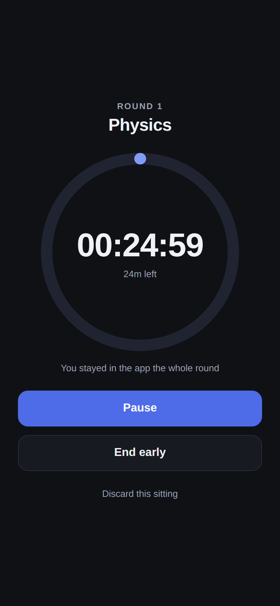
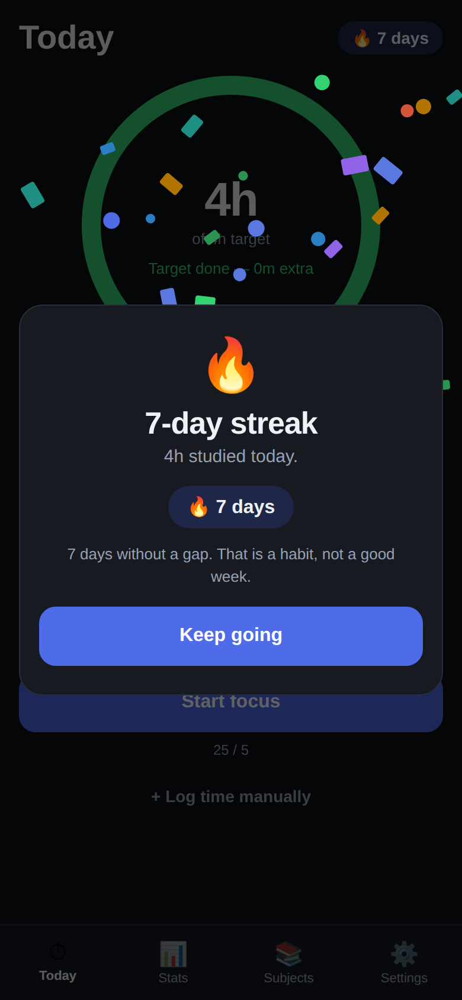
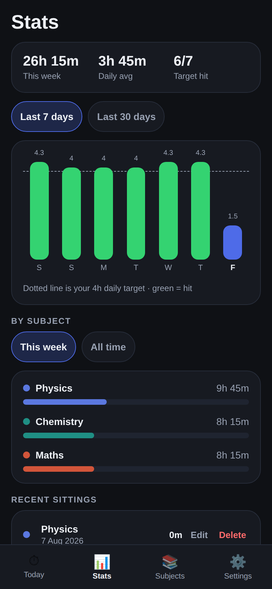
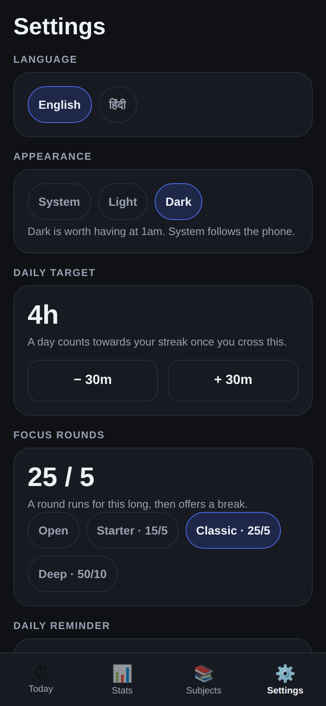

# Padhai Streak

A study timer for Indian exam aspirants — JEE, NEET, UPSC, SSC, CAT. Start the
clock for a subject, and the app answers the only question that matters at
11pm: *did I hit today's target, and is my streak alive?*

Built with React Native + Expo. Runs on Android and iPhone from one codebase.
English and हिंदी. No login, no server, no internet needed.

| First run | Today | Focus mode | Target hit | Stats |
| --- | --- | --- | --- | --- |
|  |  |  |  |  |

And in the dark, which is when a lot of this app actually gets used:

| Today | Focus mode | Target hit | Stats | Settings |
| --- | --- | --- | --- | --- |
|  |  |  |  |  |

## Why this one

Aspirants already track study hours — in notebooks, in Excel, in Instagram
stories. The tracking is the habit; the app just has to be faster than the
notebook and honest about the numbers.

- **Daily target, not vanity hours.** A day counts only when you cross your
  own target, so the streak means something.
- **The streak forgives today.** An unfinished today never breaks the streak —
  the day is still in progress. Only a genuinely missed day does. Getting this
  wrong would punish people at 9am for a day they haven't finished yet.
- **Subject-wise, because prep is subject-wise.** Where the hours actually
  went is the useful part, not the total.
- **Exam countdown.** "JEE Mains in 96 days" sits on the home screen, because
  that is the number aspirants already count in their head.
- **Hindi is a first-class language,** down to the duration units (`4घं 30मि`,
  not `4h 30m`). A large share of the audience preps in Hindi medium.
- **Offline and private.** Everything is on the phone. No account, no upload.
- **The day's target is marked, once.** Crossing it gets confetti and the
  streak; the same day reopened gets nothing. A tracker that congratulates you
  every time you open it stops meaning anything.
- **Dark, because 1am is a normal study hour.** Light, dark, or follow the
  phone — and both palettes are held to WCAG AA by a test, not by eye.

## Features

**Getting started**

- Four questions on first run — language, exam, daily target, subjects — all
  skippable, and never shown again
- Skipping still leaves a usable app on sensible defaults

**Focus rounds**

- Pick a round length — Open, Starter 15/5, Classic 25/5, Deep 50/10, or your own
- Starting a round takes over the whole screen: one dial, one subject, no tabs
- A finished round offers a break, another round, or stopping — nothing is
  saved behind your back
- Break timer runs on its own clock and never counts as study time
- Live clock keeps counting while the app is closed or the phone is locked
- Screen stays awake while a round runs, and a notification fires when the
  round is up, so the phone can stay face-down for the whole 25 minutes
- Leaving the app mid-round is counted and reported back to you, per round and
  in your stats as *clean rounds*

**Tracking**

- Daily target shown as a dial, with a streak counter
- Crossing the target celebrates — once a day, with a bigger moment on the
  first day ever and on milestone streaks
- 7-day and 30-day bar charts against your target line
- 12-week calendar heatmap, with weekday rows and a colour scale you can read
- Subject breakdown for this week or all time
- Tap a subject for its own screen: how long since you last touched it, its own
  30-day chart, its share of the week, and its sittings
- Recent sittings list — change a sitting's length, date or subject, or delete it
- Best streak, total hours, sittings, phone checks
- Backup to a file you can keep, and restore onto a new phone
- Manual entry for study you did away from the phone
- Exam name + date countdown
- Light or dark, or follow the phone
- Full English / हिंदी interface

**Notifications** — all scheduled on the phone, none of them needing a server

- One daily reminder, at a time you choose
- An alarm when a round is up, so the phone can stay face-down
- A nudge when one subject has gone a week untouched, naming the subject and
  counting the days as of the moment the notification will actually arrive
- A warning at 9:30pm when a live streak is still short of the day's target,
  with how much is left — sent only if the day is genuinely unfinished
- Each can be switched off on its own, and none of them ever prompts for
  permission on its own account

## Run it

```sh
npm install
npx expo start
```

Scan the QR with **Expo Go** (Android/iOS) and it opens on your phone. Or press
`w` for the browser, `a` for an Android emulator.

To produce an installable APK, use EAS Build (needs a free Expo account):

```sh
npx eas build -p android --profile preview
```

Note: the daily reminder needs a real install. Notifications do not schedule in
the browser preview, and Android support in Expo Go is limited — the app says
so in Settings rather than pretending the reminder is on.

## How it's built

```
App.tsx                  tab shell, or focus mode when a round is running
src/store.tsx            state, actions, persistence, useT/useDuration hooks
src/i18n.ts              English + Hindi dictionaries
src/types.ts             Subject, Session, ActiveTimer, Reminder, AppState
src/theme.tsx            both palettes, the theme provider, spacing
src/lib/storage.ts       AsyncStorage load/save
src/lib/dates.ts         local-day keys, date parsing
src/lib/stats.ts         day totals, streaks, subject totals
src/lib/format.ts        duration formatting (language-aware units)
src/lib/notifications.ts daily reminder scheduling
src/lib/backup.ts        backup serialise/parse (pure, heavily tested)
src/lib/backupTransport.ts  file, share sheet, picker (platform-specific)
src/lib/presets.ts       round/break lengths
src/lib/celebrate.ts     when the day's target is worth marking
src/components/          Ring (SVG dial), Card, Button, Chip, Sheet, Confirm,
                         Celebration + Confetti
src/screens/             Onboarding, Today, Focus, Stats, Subjects,
                         SubjectDetail, Settings
```

Five decisions worth knowing:

- **The timer is timestamps, never a counter.** A running session stores
  `runningSince` plus banked seconds, so time spent with the app swiped away —
  or the phone face-down for two hours — is still counted. A `setInterval` only
  drives the display, and only while the clock is visibly running.
- **An open-ended sitting stops crediting after six hours.** A phone left on
  the desk overnight would otherwise invent a day's target out of nothing. The
  cap dates the sitting too: it stopped counting six hours in, so that is when
  it stopped.
- **The round-end notification does not claim the round is saved.** Nothing is
  banked until you come back and choose, so it says "open the app to save it".
- **A backup never carries a running timer.** Restoring someone into a
  half-finished round on another phone, hours later, would credit time nobody
  studied. The active timer is dropped on export and again on import.
- **A restore says what it holds before it overwrites.** The file is parsed
  first, so the confirmation names how many sittings are at stake rather than
  asking for a blind yes.
- **Colours are computed against their own ground, not picked by eye.** Both
  palettes clear WCAG AA on every surface they are used on, and a unit test
  fails if an edit drops one below the bar — which it did, three times, during
  the dark-mode work. Light is a lavender ground with white cards and a royal
  indigo accent; dark is a near-black ground with cards that are *lighter* than
  it, because a shadow on a dark ground separates nothing.
- **Subject colours are the hard case, and they are solved once.** A subject's
  colour is written onto it when it is created, so it cannot follow the theme —
  one value has to work on both grounds. The palette is the set that clears 3:1
  on all six surfaces a subject dot can land on, which is why they are mid-tones
  rather than the brighter set either theme would have picked alone. Subjects
  created before dark mode existed are migrated on load and on restore, so
  nobody is left with a dot they cannot see.
- **The celebration fires once a day, and remembers.** Crossing the daily
  target is marked with confetti; the day is banked the instant the card is
  shown, so reopening the app that evening — or restoring the backup onto
  another phone — gets nothing. It is deliberately not per round: a Classic
  25/5 day is nine rounds, and nine celebrations before lunch is a popup, not a
  moment. The first target ever met outranks a milestone streak, so someone who
  backfills a week of past study is told they have started rather than handed a
  seven-day trophy for an afternoon of typing.
- **Confetti runs on one clock, and stops when asked.** Thirty-four pieces
  interpolate their own slice of a single native-driver `Animated.Value`, so a
  celebration during a break does not fight the timer for the JS thread. With
  reduce-motion on it is dropped entirely rather than slowed — the message is
  the part that matters.
- **A subject's own screen leads with neglect, not with its total.** "27h all
  time" is the flattering number and the useless one; "last studied 9 days ago"
  is what changes tomorrow's timetable. The gap is counted from the dates, never
  from the chart's array — an index lookup returns −1 for anything older than
  the window, which renders as a confident, wrong "30 days ago".
- **First run asks four questions, and an existing user never sees them.**
  Language, exam, daily target, subjects — the settings a new user would
  otherwise have to go looking for, asked once and then gone. The flag that
  records it defaults to *true* for any save that predates it, because a save
  that exists belongs to someone already using the app; defaulting it to false
  would greet them, on upgrade, with a wizard for an app they have used for
  weeks. Erasing your data keeps the flag too — clearing your history is not
  the same as being a new user, and a four-step wizard is not what "Erase"
  promised.
- **The calendar's rows are weekdays, and now say so.** 84 days ending today
  divides evenly by seven, so row *N* of the grid is always the same weekday —
  which makes "I always lose Sundays" visible, but only once the rows are
  labelled. They are, in Hindi as well as English, and an empty twelve weeks
  now says it is empty rather than showing 84 identical squares under a legend
  about colour.
- **The screen follows the day over, not just the data.** Day windows are
  recomputed when the local date changes, so an app left open at 00:01 shows
  the new day rather than last night's total.
- **Days are local calendar days, dated by when the clock stopped.** A session
  ending at 1am belongs to that 1am day. Crucially that means the instant the
  timer stopped, not the instant the user got round to tapping save: a round
  that ran out at 23:20 and is saved the next morning still belongs to last
  night, along with the streak it earned.
- **Confirmations are Modals, not `Alert.alert`.** `Alert` is unreliable on
  web, and the app is previewed there during development.
- **A finished round freezes, it does not auto-save.** The clock stops and the
  screen asks what next. Credit is capped at the length you asked for, so a
  25-minute round left running for an hour still credits 25 minutes.
- **Leaving the app is counted, not blocked.** Flipd-style Full Lock is an
  OS-level feature this app cannot honestly claim, so instead every round
  records how many times it went to the background, and the stats show how many
  rounds were clean. Measuring is honest; pretending to lock the phone is not.
- **`expo-notifications` is imported lazily, behind try/catch.** Scheduling is
  unavailable in the browser and restricted in Expo Go; neither should take the
  Settings screen down with it.

## Testing

```sh
npm test          # 146 unit tests (jest-expo)
npm run typecheck # tsc --noEmit
```

Unit tests cover the logic that is easy to get quietly wrong: streaks across
missed days and in-progress days, best-streak detection across gaps, month and
leap-day boundaries, rejection of impossible dates like 31 February and times
like 25:00, the timer's pause/resume/app-closed arithmetic, round crediting
(capped at the planned length, honest when ended early), the instant a stopped
round is dated to, when a day's target is worth celebrating and the several
ways it must stay quiet, who counts as already onboarded, how long ago a
subject was last studied, day gaps across months and leap days, weekday letters
in both languages and the fact that
the calendar's rows really are fixed weekdays, preset lengths, storage upgrades from older saves, a
check that every Hindi string keeps the same `{placeholders}` as its English
original, and both palettes measured against every ground they are painted on.

The two background nudges get their own suite, because they are the only text
this app shows when it is not on screen and the thing worth proving is not that
they fire but that what they say is still true when they arrive: a neglect
nudge scheduled tonight counts the gap as it will read tomorrow evening, one is
never raised against a subject that has simply never been started, and the
streak warning refuses to roll over to a night on which it would be a lie.

The UI is additionally driven end-to-end in a browser (react-native-web +
headless Chromium) — see `e2e/` for how to run them, 170 checks in all. The main
script's 44 cover: a fixed round run to completion, the
break that follows it, skipping a break, open-ended sittings, pause freezing
the countdown, distraction counts surfacing in focus mode, the calendar and
clean-round stats, a round finished last night and saved this morning landing
on last night, moving a past sitting to another subject and date (and the
refusal to move one into the future), the Hindi switch across the new screens,
and persistence across a full reload.

`e2e/run-backup.js` saves a real file through the browser's download path,
wipes the app, and restores from that file's text — including what happens when
the pasted text is junk or belongs to another app.

`e2e/run-theme.js` drives dark mode through the browser twice — once with the
OS reporting light and once dark — and reads the colours the app actually
painted rather than the ones the token file claims. It also proves the subject
migration end to end, by seeding a subject in the old colour and checking no
such dot reaches the screen.

`e2e/run-a11y.js` walks every screen measuring what a screen reader and a thumb
actually get: an accessible name on every control, a 44px minimum on every tap
target, and — since the redesign replaced the emoji with drawn icons — that not
one of those drawings announces itself as an image next to the label it already
illustrates. It caught the segmented control shipping at 38px.

`e2e/run-celebrate.js` is mostly about the celebration *not* happening. Firing
is one check; the rest are the ways it must stay silent — a day still short of
the target, a day already celebrated, a reload that evening, a state restored
from a phone where it was already seen, and the midnight rollover.

A further script, `e2e/run-midnight.js`, installs a fake clock at 23:59:30 and
fast-forwards past midnight with the app left open. Without the day-rollover
handling it fails loudly: the dial keeps yesterday's total and announces
"Target done" for a day with nothing studied in it.

## Compared to Flipd

The round/break structure, the full-screen dial and the calendar view are
modelled on [Flipd](https://www.flipdapp.co/). Three of its headline features
are deliberately absent, because they cannot be done honestly in an offline app
with no account:

- **Full Lock** — blocking other apps needs OS-level permissions. This app
  counts how often you leave instead.
- **Live study rooms and leaderboards** — these need a server and an account.
- **Lofi radio** — licensed audio, and streaming would break the offline promise.

## Running it on a phone

Verified on a real Android device from an EAS `preview` build: the app installs
and runs, and the daily reminder arrives at the time it was set for. Everything
else in `docs/DEVICE-TESTING.md` is still open — that checklist tracks what has
and has not been through hardware, and `eas.json` has the `preview` profile
that builds the installable APK.

## Not built yet

- Notification copy that reacts to the day's progress *as it changes*. The two
  nudges that exist are honest because nothing but this app writes study data,
  so they can be rebuilt from live state every time it changes. "2h done, 2h to
  go" cannot be: its text is fixed when it is scheduled, the app cannot run in
  the background to refresh it, and the clock moves on its own.
- A live countdown *inside* the notification shade (the alarm fires at the end,
  it does not tick)
- Widgets, watch app, or automatic cloud backup

## Licence

MIT
