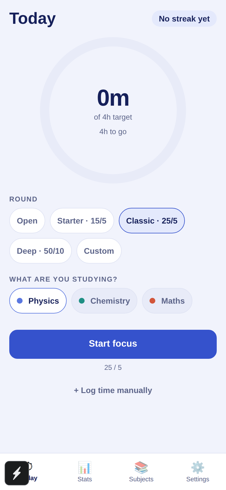
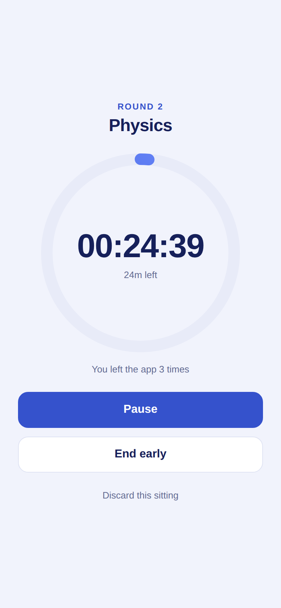
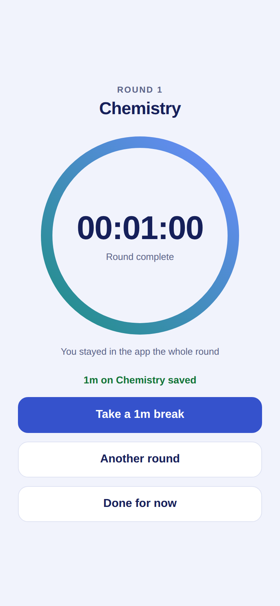
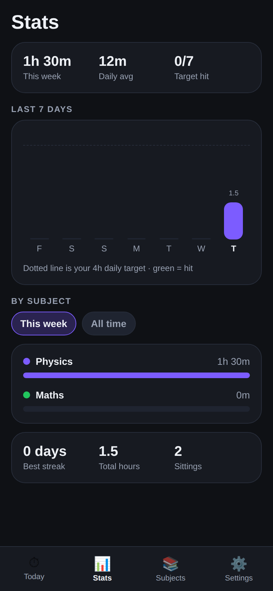

# Padhai Streak

A study timer for Indian exam aspirants — JEE, NEET, UPSC, SSC, CAT. Start the
clock for a subject, and the app answers the only question that matters at
11pm: *did I hit today's target, and is my streak alive?*

Built with React Native + Expo. Runs on Android and iPhone from one codebase.
English and हिंदी. No login, no server, no internet needed.

| Today | Focus mode | Round done | Stats |
| --- | --- | --- | --- |
|  |  |  |  |

## Why this one

Aspirants already track study hours — in notebooks, in Excel, in Instagram
stories. The tracking is the habit; the app just has to be faster than the
notebook and honest about the numbers.

- **Daily target, not vanity hours.** A day counts only when you cross your
  own target, so the streak means something.
- **The streak forgives today.** An unfinished today never breaks the streak —
  the day is still in progress. Only a genuinely missed day does. Getting this
  wrong would punish people at 9am for a day they haven't finished yet.
- **Subject-wise, because prep is subject-wise.** Where the hours actually
  went is the useful part, not the total.
- **Exam countdown.** "JEE Mains in 96 days" sits on the home screen, because
  that is the number aspirants already count in their head.
- **Hindi is a first-class language,** down to the duration units (`4घं 30मि`,
  not `4h 30m`). A large share of the audience preps in Hindi medium.
- **Offline and private.** Everything is on the phone. No account, no upload.

## Features

**Focus rounds**

- Pick a round length — Open, Starter 15/5, Classic 25/5, Deep 50/10, or your own
- Starting a round takes over the whole screen: one dial, one subject, no tabs
- A finished round offers a break, another round, or stopping — nothing is
  saved behind your back
- Break timer runs on its own clock and never counts as study time
- Live clock keeps counting while the app is closed or the phone is locked
- Screen stays awake while a round runs, and a notification fires when the
  round is up, so the phone can stay face-down for the whole 25 minutes
- Leaving the app mid-round is counted and reported back to you, per round and
  in your stats as *clean rounds*

**Tracking**

- Daily target shown as a dial, with a streak counter
- 7-day and 30-day bar charts against your target line
- 12-week calendar heatmap
- Subject breakdown for this week or all time
- Recent sittings list — change a sitting's length, date or subject, or delete it
- Best streak, total hours, sittings, phone checks
- Manual entry for study you did away from the phone
- Exam name + date countdown
- One daily reminder notification, at a time you choose
- Full English / हिंदी interface

## Run it

```sh
npm install
npx expo start
```

Scan the QR with **Expo Go** (Android/iOS) and it opens on your phone. Or press
`w` for the browser, `a` for an Android emulator.

To produce an installable APK, use EAS Build (needs a free Expo account):

```sh
npx eas build -p android --profile preview
```

Note: the daily reminder needs a real install. Notifications do not schedule in
the browser preview, and Android support in Expo Go is limited — the app says
so in Settings rather than pretending the reminder is on.

## How it's built

```
App.tsx                  tab shell, or focus mode when a round is running
src/store.tsx            state, actions, persistence, useT/useDuration hooks
src/i18n.ts              English + Hindi dictionaries
src/types.ts             Subject, Session, ActiveTimer, Reminder, AppState
src/theme.ts             colours and spacing
src/lib/storage.ts       AsyncStorage load/save
src/lib/dates.ts         local-day keys, date parsing
src/lib/stats.ts         day totals, streaks, subject totals
src/lib/format.ts        duration formatting (language-aware units)
src/lib/notifications.ts daily reminder scheduling
src/lib/presets.ts       round/break lengths
src/components/          Ring (SVG dial), Card, Button, Chip, Sheet, Confirm
src/screens/             Today, Focus, Stats, Subjects, Settings
```

Five decisions worth knowing:

- **The timer is timestamps, never a counter.** A running session stores
  `runningSince` plus banked seconds, so time spent with the app swiped away —
  or the phone face-down for two hours — is still counted. A `setInterval` only
  drives the display, and only while the clock is visibly running.
- **The screen follows the day over, not just the data.** Day windows are
  recomputed when the local date changes, so an app left open at 00:01 shows
  the new day rather than last night's total.
- **Days are local calendar days, dated by when the clock stopped.** A session
  ending at 1am belongs to that 1am day. Crucially that means the instant the
  timer stopped, not the instant the user got round to tapping save: a round
  that ran out at 23:20 and is saved the next morning still belongs to last
  night, along with the streak it earned.
- **Confirmations are Modals, not `Alert.alert`.** `Alert` is unreliable on
  web, and the app is previewed there during development.
- **A finished round freezes, it does not auto-save.** The clock stops and the
  screen asks what next. Credit is capped at the length you asked for, so a
  25-minute round left running for an hour still credits 25 minutes.
- **Leaving the app is counted, not blocked.** Flipd-style Full Lock is an
  OS-level feature this app cannot honestly claim, so instead every round
  records how many times it went to the background, and the stats show how many
  rounds were clean. Measuring is honest; pretending to lock the phone is not.
- **`expo-notifications` is imported lazily, behind try/catch.** Scheduling is
  unavailable in the browser and restricted in Expo Go; neither should take the
  Settings screen down with it.

## Testing

```sh
npm test          # 55 unit tests (jest-expo)
npm run typecheck # tsc --noEmit
```

Unit tests cover the logic that is easy to get quietly wrong: streaks across
missed days and in-progress days, best-streak detection across gaps, month and
leap-day boundaries, rejection of impossible dates like 31 February and times
like 25:00, the timer's pause/resume/app-closed arithmetic, round crediting
(capped at the planned length, honest when ended early), the instant a stopped
round is dated to, preset lengths, storage upgrades from older saves, and a
check that every Hindi string keeps the same `{placeholders}` as its English
original.

The UI is additionally driven end-to-end in a browser (react-native-web +
headless Chromium) — see `e2e/` for how to run them. 37 checks cover: a fixed round run to completion, the
break that follows it, skipping a break, open-ended sittings, pause freezing
the countdown, distraction counts surfacing in focus mode, the calendar and
clean-round stats, a round finished last night and saved this morning landing
on last night, moving a past sitting to another subject and date (and the
refusal to move one into the future), the Hindi switch across the new screens,
and persistence across a full reload.

A second script, `e2e/run-midnight.js`, installs a fake clock at 23:59:30 and
fast-forwards past midnight with the app left open. Without the day-rollover
handling it fails loudly: the dial keeps yesterday's total and announces
"Target done" for a day with nothing studied in it.

## Compared to Flipd

The round/break structure, the full-screen dial and the calendar view are
modelled on [Flipd](https://www.flipdapp.co/). Three of its headline features
are deliberately absent, because they cannot be done honestly in an offline app
with no account:

- **Full Lock** — blocking other apps needs OS-level permissions. This app
  counts how often you leave instead.
- **Live study rooms and leaderboards** — these need a server and an account.
- **Lofi radio** — licensed audio, and streaming would break the offline promise.

## Not built yet

- Notification copy that reacts to the day's progress (it is a fixed daily nudge)
- A live countdown *inside* the notification shade (the alarm fires at the end,
  it does not tick)
- Widgets, watch app, or cloud backup

## Licence

MIT
