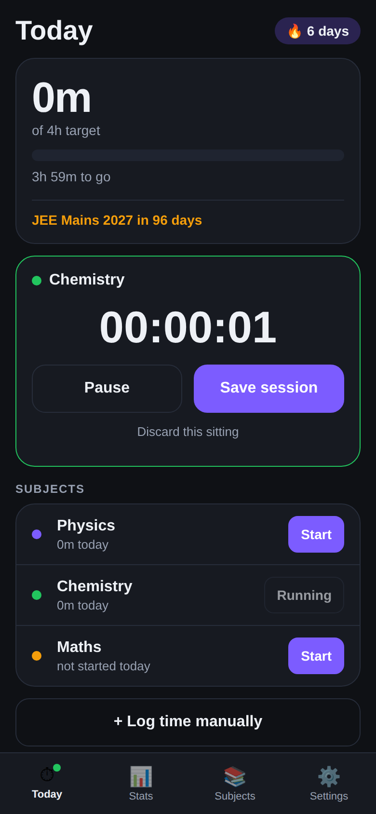
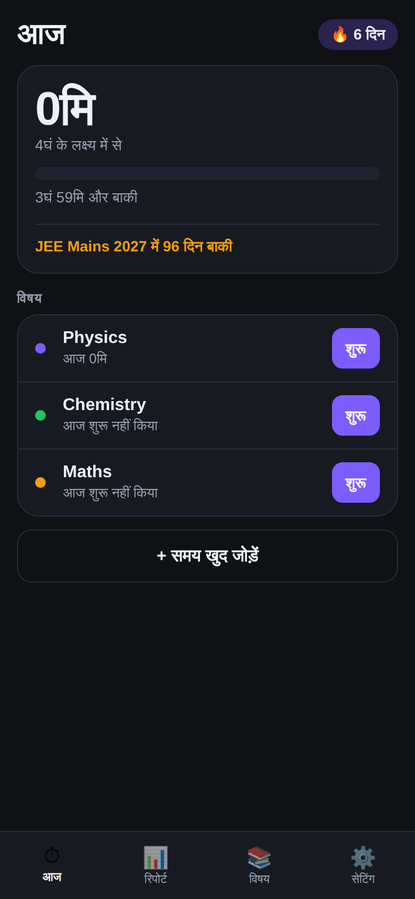

# Padhai Streak

A study timer for Indian exam aspirants — JEE, NEET, UPSC, SSC, CAT. Start the
clock for a subject, and the app answers the only question that matters at
11pm: *did I hit today's target, and is my streak alive?*

Built with React Native + Expo. Runs on Android and iPhone from one codebase.
English and हिंदी. No login, no server, no internet needed.

| Today | Running | Stats | हिंदी |
| --- | --- | --- | --- |
|  |  |  |  |

## Why this one

Aspirants already track study hours — in notebooks, in Excel, in Instagram
stories. The tracking is the habit; the app just has to be faster than the
notebook and honest about the numbers.

- **Daily target, not vanity hours.** A day counts only when you cross your
  own target, so the streak means something.
- **The streak forgives today.** An unfinished today never breaks the streak —
  the day is still in progress. Only a genuinely missed day does. Getting this
  wrong would punish people at 9am for a day they haven't finished yet.
- **Subject-wise, because prep is subject-wise.** Where the hours actually
  went is the useful part, not the total.
- **Exam countdown.** "JEE Mains in 96 days" sits on the home screen, because
  that is the number aspirants already count in their head.
- **Hindi is a first-class language,** down to the duration units (`4घं 30मि`,
  not `4h 30m`). A large share of the audience preps in Hindi medium.
- **Offline and private.** Everything is on the phone. No account, no upload.

## Features

- One-tap timer per subject, with pause/resume and discard
- Live clock that keeps counting while the app is closed or the phone is locked
- Screen stays awake while a session runs
- Manual entry for study you did away from the phone
- Daily target with progress bar, and a streak counter
- 7-day and 30-day bar charts against your target line
- Subject breakdown for this week or all time
- Recent sittings list — edit the minutes or delete a sitting outright
- Best streak, total hours, sittings count
- Exam name + date countdown
- One daily reminder notification, at a time you choose
- Full English / हिंदी interface
- Quick-add subject chips for common exam tracks

## Run it

```sh
npm install
npx expo start
```

Scan the QR with **Expo Go** (Android/iOS) and it opens on your phone. Or press
`w` for the browser, `a` for an Android emulator.

To produce an installable APK, use EAS Build (needs a free Expo account):

```sh
npx eas build -p android --profile preview
```

Note: the daily reminder needs a real install. Notifications do not schedule in
the browser preview, and Android support in Expo Go is limited — the app says
so in Settings rather than pretending the reminder is on.

## How it's built

```
App.tsx                  tab shell (4 tabs, local state — no router needed)
src/store.tsx            state, actions, persistence, useT/useDuration hooks
src/i18n.ts              English + Hindi dictionaries
src/types.ts             Subject, Session, ActiveTimer, Reminder, AppState
src/theme.ts             colours and spacing
src/lib/storage.ts       AsyncStorage load/save
src/lib/dates.ts         local-day keys, date parsing
src/lib/stats.ts         day totals, streaks, subject totals
src/lib/format.ts        duration formatting (language-aware units)
src/lib/notifications.ts daily reminder scheduling
src/components/          Card, Button, ProgressBar, Chip, Sheet, Confirm
src/screens/             Today, Stats, Subjects, Settings
```

Four decisions worth knowing:

- **The timer is timestamps, never a counter.** A running session stores
  `runningSince` plus banked seconds, so time spent with the app swiped away —
  or the phone face-down for two hours — is still counted. A `setInterval` only
  drives the display, and only while the clock is visibly running.
- **Days are local calendar days.** A session ending at 1am belongs to that
  1am day. Someone studying past midnight has started a new day, and pretending
  otherwise would make streaks lie.
- **Confirmations are Modals, not `Alert.alert`.** `Alert` is unreliable on
  web, and the app is previewed there during development.
- **`expo-notifications` is imported lazily, behind try/catch.** Scheduling is
  unavailable in the browser and restricted in Expo Go; neither should take the
  Settings screen down with it.

## Testing

```sh
npm test          # 29 unit tests (jest-expo)
npm run typecheck # tsc --noEmit
```

Unit tests cover the logic that is easy to get quietly wrong: streaks across
missed days and in-progress days, best-streak detection across gaps, month and
leap-day boundaries, rejection of impossible dates like 31 February and times
like 25:00, the timer's pause/resume/app-closed arithmetic, and a check that
every Hindi string keeps the same `{placeholders}` as its English original.

The UI is additionally driven end-to-end in a browser (react-native-web +
headless Chromium) across 22 checks: seeded history and streak counting,
running/pausing/saving a session, manual logging, editing and deleting a
sitting, the 30-day range, exam countdown, invalid-date and invalid-time
handling, the Hindi switch including localised duration units, and persistence
across a full reload.

## Not built yet

- Notification copy that reacts to the day's progress (it is a fixed daily nudge)
- History beyond 30 days, and a calendar/month view
- Editing the date or subject of a past sitting (only its length)
- Widgets, watch app, or cloud backup

## Licence

MIT
